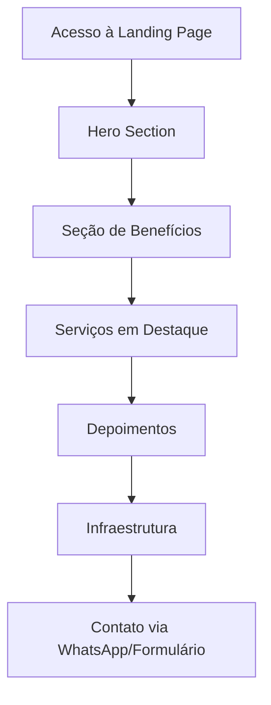

# Documento de Requisitos do Produto - Auto Escola Neon Cotia

## 1. Visão Geral do Produto

Landing page única para a Auto Escola Neon Cotia, replicando fielmente o design e estrutura da página de referência da Auto Escola Pinheiros. A página tem como objetivo apresentar os serviços da autoescola, gerar confiança através de depoimentos e facilitar o contato com potenciais alunos.

- Público-alvo: Pessoas interessadas em obter carteira de habilitação na região de Cotia
- Objetivo: Converter visitantes em leads qualificados através de uma experiência visual atrativa e informações claras sobre os serviços

## 2. Funcionalidades Principais

### 2.1 Papéis de Usuário

Não há distinção de papéis de usuário. Todos os visitantes têm acesso completo ao conteúdo da landing page.

### 2.2 Módulos de Funcionalidade

Nossa landing page da Auto Escola Neon Cotia consiste nas seguintes páginas principais:

1. **Página Principal**: header com navegação, hero section, seções de benefícios, serviços em destaque, depoimentos, localização e footer.

### 2.3 Detalhes das Páginas

| Nome da Página | Nome do Módulo | Descrição da Funcionalidade |
|----------------|----------------|------------------------------|
| Página Principal | Header | Navegação principal com logo "Auto Escola Neon Cotia", menu de navegação (Início, Habilitação, Primeira Habilitação, Blog, Simulados, Contato) e botão de WhatsApp |
| Página Principal | Hero Section | Seção principal com imagem de fundo, título "Sua autoescola de confiança", call-to-action "Fale conosco" e card lateral com informações sobre habilitação |
| Página Principal | Seção de Benefícios | Três cards com ícones destacando: Aulas Práticas, Aulas Teóricas e Simulados Completos |
| Página Principal | Serviços em Destaque | Três cards vermelhos principais: Primeira Habilitação, Reciclagem e Renovação, cada um com imagem, título e botão "Saiba mais" |
| Página Principal | Seção Institucional | Logo da Auto Escola Neon Cotia com slogan "Ensino de qualidade há X anos" |
| Página Principal | Depoimentos | Seção "Somos referência em nossa categoria" com depoimento de cliente e vídeo |
| Página Principal | Infraestrutura | Seção "Garagem e infraestrutura completa" com imagens das instalações |
| Página Principal | Avaliações | Seção de satisfação com avaliações do Google |
| Página Principal | Footer | Informações de contato, endereços das unidades, links úteis e formulário de contato |
| Página Principal | Seção de Unidades | Cards com informações das três unidades: endereços, telefones e botões de contato |

## 3. Processo Principal

Fluxo principal do usuário:
1. Usuário acessa a landing page
2. Visualiza o hero section com proposta de valor
3. Explora os benefícios e serviços oferecidos
4. Lê depoimentos e avaliações para gerar confiança
5. Visualiza infraestrutura e localização
6. Entra em contato através dos botões de WhatsApp ou formulário

## 4. Design da Interface do Usuário

### 4.1 Estilo de Design

- **Cores primárias**: Vermelho (#E31E24 ou similar), Branco (#FFFFFF)
- **Cores secundárias**: Cinza claro para backgrounds, Preto para textos
- **Estilo de botões**: Botões vermelhos com bordas arredondadas, efeito hover
- **Fonte**: Sans-serif moderna, tamanhos variados (títulos grandes, textos médios)
- **Layout**: Design em cards, navegação superior fixa, seções bem definidas
- **Ícones**: Ícones minimalistas em branco nos cards de serviços

### 4.2 Visão Geral do Design das Páginas

| Nome da Página | Nome do Módulo | Elementos da UI |
|----------------|----------------|------------------|
| Página Principal | Header | Fundo branco, logo vermelha, menu horizontal, botão WhatsApp verde |
| Página Principal | Hero Section | Fundo cinza com imagem de mulher sorrindo, overlay escuro, texto branco, botão vermelho CTA |
| Página Principal | Benefícios | Fundo branco, três cards com ícones circulares vermelhos, textos centralizados |
| Página Principal | Serviços | Três cards vermelhos com imagens, texto branco, botões brancos |
| Página Principal | Depoimentos | Fundo cinza claro, layout em duas colunas com texto e vídeo |
| Página Principal | Footer | Fundo vermelho, texto branco, layout em colunas, formulário integrado |

### 4.3 Responsividade

Design mobile-first com adaptação para desktop. Otimização para interação touch em dispositivos móveis, com botões de tamanho adequado e navegação simplificada em telas menores.