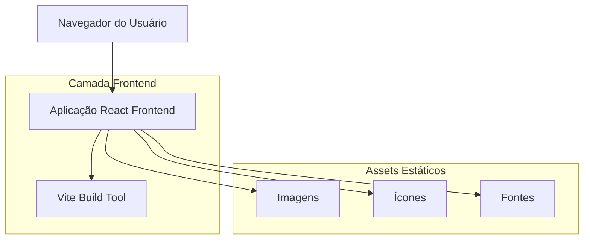

# Documento de Arquitetura Técnica - Auto Escola Neon Cotia

## 1. Design da Arquitetura



## 2. Descrição da Tecnologia

* **Frontend**: React\@18 + TypeScript + Tailwind CSS\@3 + Vite\@5

* **Backend**: Nenhum (landing page estática)

* **Hospedagem**: Compatível com Vercel, Netlify ou GitHub Pages

## 3. Definições de Rotas

| Rota | Propósito                                                                         |
| ---- | --------------------------------------------------------------------------------- |
| /    | Página principal da landing page, exibe todo o conteúdo da Auto Escola Neon Cotia |

## 4. Definições de API

Não aplicável - Esta é uma landing page estática sem necessidade de APIs backend.

## 5. Arquitetura do Servidor

Não aplicável - Projeto frontend estático.

## 6. Modelo de Dados

### 6.1 Definição do Modelo de Dados

Como se trata de uma landing page estática, os dados são hardcoded nos componentes React. Principais estruturas de dados:

```typescript
// Tipos TypeScript para os dados da aplicação

interface ServiceCard {
  id: string;
  title: string;
  description: string;
  image: string;
  buttonText: string;
}

interface BenefitCard {
  id: string;
  icon: string;
  title: string;
  description: string;
}

interface TestimonialData {
  customerName: string;
  content: string;
  rating: number;
  videoUrl?: string;
}

interface ContactInfo {
  address: string;
  phone: string;
  whatsapp: string;
  email: string;
}

interface UnitInfo {
  id: string;
  name: string;
  address: string;
  phone: string;
  whatsapp: string;
}
```

### 6.2 Linguagem de Definição de Dados

Não aplicável - Dados estáticos definidos em TypeScript interfaces e objetos JavaScript.

```typescript
// Dados estáticos da aplicação
const services: ServiceCard[] = [
  {
    id: 'primeira-habilitacao',
    title: 'Primeira Habilitação',
    description: 'Processo completo para obter sua primeira CNH',
    image: '/images/primeira-habilitacao.jpg',
    buttonText: 'Saiba mais'
  },
  {
    id: 'reciclagem',
    title: 'Reciclagem',
    description: 'Curso de reciclagem para renovação da CNH',
    image: '/images/reciclagem.jpg',
    buttonText: 'Saiba mais'
  },
  {
    id: 'renovacao',
    title: 'Renovação',
    description: 'Renovação rápida e prática da sua habilitação',
    image: '/images/renovacao.jpg',
    buttonText: 'Saiba mais'
  }
];

const benefits: BenefitCard[] = [
  {
    id: 'aulas-praticas',
    icon: 'car-icon',
    title: 'Aulas Práticas',
    description: 'Aulas práticas com instrutores qualificados'
  },
  {
    id: 'aulas-teoricas',
    title: 'Aulas Teóricas',
    icon: 'book-icon',
    description: 'Material didático atualizado e aulas dinâmicas'
  },
  {
    id: 'simulados',
    icon: 'test-icon',
    title: 'Simulados Completos',
    description: 'Simulados online para garantir sua aprovação'
  }
];

const contactInfo: ContactInfo = {
  address: 'Endereço da Auto Escola Neon Cotia',
  phone: '(11) XXXX-XXXX',
  whatsapp: '(11) 9XXXX-XXXX',
  email: 'contato@autoescolaneon.com.br'
};
```

